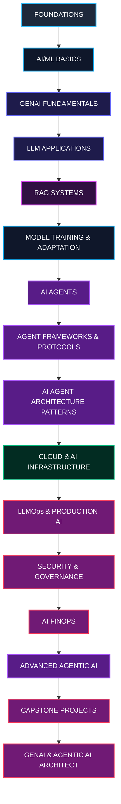

# GenAI & Agentic AI Learning Roadmap 2026 — Beginner to Production Architect

Welcome to the **GenAI & Agentic AI Learning Roadmap 2026**. This roadmap is designed to guide learners, software developers, cloud engineers, and system architects from absolute beginners to elite enterprise architects in Generative AI and Agentic AI. 

---

## 🗺️ One-Page Visual Roadmap

The journey flows progressively from core software foundations to complex multi-agent system design and cloud architecting.



### Infographic Overview
Below is a high-level conceptual mapping of your learning journey:


---

## 🧠 Clarifying the Core Concepts

Before diving into the roadmap, it is essential to establish correct definitions for the technologies and phases involved.

### 🏢 Technology Domain Hierarchy
```
┌────────────────────────────────────────────────────────┐
│ ARTIFICIAL INTELLIGENCE (AI)                           │
│   ┌──────────────────────────────────────────────────┐ │
│   │ MACHINE LEARNING (ML)                            │ │
│   │   ┌────────────────────────────────────────────┐ │ │
│   │   │ DEEP LEARNING (DL)                         │ │ │
│   │   │   ┌──────────────────────────────────────┐ │ │ │
│   │   │   │ GENERATIVE AI (GenAI)                │ │ │ │
│   │   │   │   ┌────────────────────────────────┐ │ │ │ │
│   │   │   │   │ LARGE LANGUAGE MODELS (LLMs)   │ │ │ │ │
│   │   │   │   └────────────────────────────────┘ │ │ │ │ │
│   │   │   └──────────────────────────────────────┘ │ │ │ │
│   │   └────────────────────────────────────────────┘ │ │ │
│   └──────────────────────────────────────────────────┘ │
└────────────────────────────────────────────────────────┘
```

*   **Artificial Intelligence (AI):** The overarching science of building systems that perform tasks requiring human-like intelligence (e.g., reasoning, planning, decision-making).
*   **Machine Learning (ML):** A subset of AI focused on algorithms that learn statistical patterns from data to make predictions, rather than executing hand-coded rules.
*   **Deep Learning (DL):** A subset of ML utilizing multi-layered artificial neural networks (deep networks) to automatically discover complex representations from raw input.
*   **Generative AI (GenAI):** A branch of Deep Learning focused on creating novel content (text, code, images, audio, video) by predicting probabilities based on prior training data.
*   **Large Language Models (LLMs):** A specific class of GenAI models based on the Transformer architecture, trained on massive textual corpora to model, understand, and generate natural language.
*   **Retrieval Augmented Generation (RAG):** An architectural pattern that extends the capabilities of LLMs by retrieving relevant information from external data sources and appending it to the model's prompt to ensure factual, contextually-grounded output.
*   **AI Agents:** Autonomous components that use an LLM as their "reasoning engine" to run a loop of planning, memory access, and tool invocation to solve complex, multi-step tasks.
*   **Agentic AI:** The design and deployment of systems built around multiple cooperating, self-reflecting, and specialized AI agents that execute end-to-end business workflows.

---

### ⚙️ Life-Cycle Phase Distinctions
Understanding the mechanical and compute differences between model phases is critical for cost and architecture design:

| Phase | Description | Compute / Cost Profile | Key Metrics |
| :--- | :--- | :--- | :--- |
| **Training (Pre-training)** | Building a base model from scratch on raw, unstructured data (billions/trillions of tokens) to learn general language structures. | Extremely High (Millions of dollars, months, massive GPU clusters). | Loss convergence, perplexity. |
| **Fine-tuning** | Modifying a pre-trained model's weights on a specialized, labeled dataset to adopt a specific tone, style, output format, or domain knowledge. | Moderate (Hundreds/thousands of dollars, hours/days, few GPUs). | Evaluation benchmark scores. |
| **Inference** | The live execution phase where a prompt is passed to a loaded model to generate predictions (outputs) in real-time. | Low (Cents per query, milliseconds/seconds, active GPU memory). | Time to First Token (TTFT), tokens/sec. |
| **Serving** | Wrapping inference in enterprise-grade API gateways, load balancers, caching layers, and container orchestrators for production. | Scaled (Varies by traffic; uses continuous batching and scale-to-zero). | Concurrent requests, cost/request, availability. |

---

## 📈 The Learner Progression Path

The learning journey is structured across 4 distinct levels, showing a clear evolution of competencies:

```
[ LEVEL 1: AI & GenAI Beginner ]  ──> Focuses on Foundations, ML/DL Basics, & GenAI Fundamentals
               │
               ▼
[ LEVEL 2: GenAI Developer ]      ──> Focuses on LLM App Development & Retrieval Augmented Generation (RAG)
               │
               ▼
[ LEVEL 3: Agentic AI Engineer ]  ──> Focuses on Agentic AI, Frameworks, Protocols, & Agent Architecture Patterns
               │
               ▼
[ LEVEL 4: GenAI/Agentic Architect] ──> Focuses on Training, Cloud Infrastructure, LLMOps, Security, FinOps, & Advanced Design
```

### 🛣️ The Execution Framework
For every single capability, you will go through this progression:
$$\text{LEARN} \longrightarrow \text{BUILD} \longrightarrow \text{EXPERIMENT} \longrightarrow \text{DEPLOY} \longrightarrow \text{OBSERVE} \longrightarrow \text{SECURE} \longrightarrow \text{OPTIMIZE} \longrightarrow \text{ARCHITECT}$$

---

# 📚 Detailed Stage-by-Stage Breakdown

---

## Stage 1: [Foundations](file:///Users/biswanathgiri/GenAI&AgenticAI%20-Learing%20Roadmap/topics/01_foundations.md)
*Progression Step: **LEARN***

### What to Learn
*   **Python:** Asyncio concurrency, Object-Oriented Programming (OOP), type hinting, packaging, virtual environments.
*   **Git & GitHub:** Branching models, pull requests, merge conflict resolution, GitHub Actions for basic CI/CD.
*   **Linux & CLI:** SSH keys, bash scripting, file permissions, process monitoring (`top`, `ps`), environment variables.
*   **APIs, JSON, REST:** HTTP methods, status codes, serialization, rate limiting, authentication headers, WebSockets.
*   **Basic Cloud Concepts:** Virtual machines, object storage, basic networking (subnets, firewalls), IAM roles.
*   **Basic AI/ML Concepts:** Features, labels, training/testing splits, overfitting vs underfitting, regression vs classification.
*   **Mathematics Fundamentals:** Linear algebra (vector spaces, matrix multiplication), Probability (Bayes' theorem, probability distributions), Statistics (mean, variance, hypothesis testing, linear regression).

### Why It Matters
Modern AI engineering is first and foremost software engineering. You cannot build scalable, production-grade AI systems without a deep mastery of writing efficient async code, executing remote commands, and understanding the mathematical foundations of vector spaces.

*   **Prerequisites:** Basic computer literacy.
*   **Recommended Tools:** VS Code, Git, Python 3.11+, Bash.
*   **Hands-on Project:** Write an asynchronous Python CLI utility that calls a public REST API (e.g., weather, GitHub), validates payloads using Pydantic, and saves the formatted JSON to an S3-compatible local bucket (MinIO).
*   **Key Architecture Concepts:** Client-Server architecture, Stateless REST APIs, Asynchronous event loops.
*   **Production Considerations:** Storing credentials securely via environment variables (never check keys into Git); writing robust try-except loops with exponential backoff for external API connections.

### 💼 Interview Questions & Resources
*   **Q:** What is the difference between synchronous and asynchronous programming in Python, and when would you use `asyncio`?
*   **Q:** Explain what matrix multiplication is and why it forms the computational core of deep learning models.
*   **Resources:** 
    *   *Python.org Documentation (Asyncio)*
    *   *Pro Git Book (Chacon & Straub)*
    *   *Khan Academy: Linear Algebra & Probability Courses*

---

## Stage 2: [Machine Learning & Deep Learning Basics](file:///Users/biswanathgiri/GenAI&AgenticAI%20-Learing%20Roadmap/topics/02_ml_dl_basics.md)
*Progression Step: **LEARN***

### What to Learn
*   **Supervised vs Unsupervised Learning:** Labeled training (regression/classification) vs clustering and dimension reduction.
*   **Neural Networks:** Neurons, weights, biases, activation functions (ReLU, GeLU), loss functions, backpropagation, and gradient descent.
*   **Transformers:** The Encoder-Decoder architecture, self-attention, multi-head attention, positional encoding.
*   **Tokens & Tokenization:** Byte-Pair Encoding (BPE), WordPiece, vocabularies, token-to-ID mappings, out-of-vocabulary tokens.
*   **Attention Mechanism:** Scaled Dot-Product Attention math, Q (Query), K (Key), V (Value) vectors, cross-attention.
*   **Embeddings:** Representing words/concepts in continuous vector space, vector dimensions, cosine similarity.
*   **Model Parameters:** Weights and biases, active vs passive parameters, model scaling laws.
*   **Context Windows:** Limitations of self-attention complexity ($O(N^2)$ space/time complexity), scaling mechanics (e.g., RoPE).
*   **GPUs, TPUs & AI Accelerators:** VRAM constraints, parallel computation, matrix cores (Tensor Cores), FP16 vs BF16 precision.

### Why It Matters
Understanding what happens to text when it is sliced into tokens, projected into high-dimensional vector spaces, and passed through attention matrices is vital for diagnosing model degradation, context scaling problems, and performance issues.

*   **Prerequisites:** Foundations (Stage 1), Linear Algebra.
*   **Recommended Tools:** PyTorch, NumPy, Hugging Face Tokenizers.
*   **Hands-on Project:** Write a feed-forward neural network from scratch using PyTorch to classify handwritten digits (MNIST dataset) and implement a simple BPE (Byte-Pair Encoding) tokenizer in pure Python.
*   **Key Architecture Concepts:** Feed-forward layers, residual connections, layer normalization, embedding projections.
*   **Production Considerations:** Keeping datasets and model weights in the correct precision format (BF16 is preferred over FP16 on modern NVIDIA GPUs to prevent numerical underflow).

### 💼 Interview Questions & Resources
*   **Q:** Explain the mathematical formula for Scaled Dot-Product Attention: $\text{Attention}(Q, K, V) = \text{softmax}\left(\frac{QK^T}{\sqrt{d_k}}\right)V$.
*   **Q:** Why does the attention mechanism have quadratic computational complexity relative to the input text length?
*   **Resources:**
    *   *Paper: "Attention Is All You Need" (Vaswani et al.)*
    *   *3Blue1Brown: Neural Networks YouTube Series*
    *   *Jay Alammar: The Illustrated Transformer Blog*

---

## Stage 3: [Generative AI Fundamentals](file:///Users/biswanathgiri/GenAI&AgenticAI%20-Learing%20Roadmap/topics/03_genai_fundamentals.md)
*Progression Step: **BUILD***

### What to Learn
*   **LLMs:** Autoregressive generation, decoder-only models (Llama, GPT) vs encoder-decoder models (T5).
*   **Foundation Models:** Base models (pre-trained next-token predictors) vs Instruction-Tuned and Chat-tuned models (RLHF/DPO).
*   **Prompt Engineering:** Zero-shot, few-shot learning, Chain-of-Thought (CoT), System Prompts vs User Prompts.
*   **Structured Output:** Enforcing output shapes using JSON Schemas, Pydantic, library interfaces (Instructor, Outlines).
*   **Function/Tool Calling:** Declaring tool definitions in JSON schema, parsing assistant requests, executing tools, returning outputs.
*   **Multimodal AI:** Vision-Language Models (VLMs), audio encoders, video generation, cross-modal alignments.
*   **Model Selection:** Evaluating benchmarks (MMLU, HumanEval), understanding parameter sizes (8B, 70B, 405B), and choosing between open-source and proprietary models.

### Why It Matters
Working with commercial or open-weight models requires knowing how to prompt them, handle their outputs reliably, and choose the most cost-effective and lowest-latency model for your specific enterprise tasks.

*   **Prerequisites:** Machine Learning & Deep Learning Basics.
*   **Recommended Tools:** OpenAI API, Anthropic Claude API, Google Gemini API, Pydantic, Instructor.
*   **Hands-on Project:** Create a parser application that takes unstructured text documents (e.g., invoices, emails), runs them through an LLM using Pydantic structured output, validates the data fields, and returns a guaranteed JSON schema.
*   **Key Architecture Concepts:** Autoregressive inference loops, sampling mechanics (temperature, top-p, top-k, frequency/presence penalties).
*   **Production Considerations:** Handling API rate limits, planning fallback models, and leveraging prompt caching to save API costs.

### 💼 Interview Questions & Resources
*   **Q:** What is the difference between a base LLM and an instruction-tuned LLM?
*   **Q:** How do libraries like Pydantic/Instructor force an LLM to output valid JSON conforming to a specific schema under the hood?
*   **Resources:**
    *   *DeepLearning.AI: Prompt Engineering for Developers Course*
    *   *OpenAI Cookbooks / Anthropic Developer Documentation*

---

## Stage 4: [LLM Application Development](file:///Users/biswanathgiri/GenAI&AgenticAI%20-Learing%20Roadmap/topics/04_llm_app_dev.md)
*Progression Step: **BUILD & EXPERIMENT***

### What to Learn
*   **Python AI SDKs:** Deep integration with Google GenAI, OpenAI, and Anthropic SDKs.
*   **Model APIs:** Streaming responses, conversational history, structured JSON interfaces.
*   **LangChain:** Chains, templates, routing, and the LangChain Expression Language (LCEL).
*   **LangGraph:** Building stateful, multi-actor applications using directed cyclic graphs, checkpoints, and time travel.
*   **LlamaIndex:** Structured indices, simple query engines, document readers.
*   **AI Application Architecture:** Decoupling frontends from backends, maintaining session IDs, utilizing streaming (Server-Sent Events).
*   **Memory:** Conversational buffer memory, summary memory, window memory, and persistent session state.
*   **Tool Integration:** Writing and exposing custom Python tools with precise docstrings and type hints.

### Why It Matters
Raw API calls are insufficient for complex software. Building stateful applications with multi-step workflows, memory over long conversations, and integration with databases requires framework-level orchestration.

*   **Prerequisites:** Generative AI Fundamentals.
*   **Recommended Tools:** Google GenAI SDK, LangGraph, FastAPI, Redis (for memory caching).
*   **Hands-on Project:** Build a FastAPI backend that uses LangGraph to manage a stateful chat session. The backend must support streaming responses (SSE), retrieve information from a custom search tool, and maintain conversation state in a Redis cache.
*   **Key Architecture Concepts:** Directed Acyclic Graphs (DAGs) vs Cyclic state machines, State persistence, Asynchronous messaging.
*   **Production Considerations:** Implementing concurrent session isolation, managing race conditions in agent states, and optimizing TTFT via async generator streaming.

### 💼 Interview Questions & Resources
*   **Q:** Why are stateful cyclic graphs (like in LangGraph) better suited for complex AI applications than linear pipelines?
*   **Q:** How would you design a memory system that doesn't exceed the LLM's context window limit over a conversation spanning hundreds of turns?
*   **Resources:**
    *   *LangGraph Conceptual Guides & Tutorials*
    *   *LlamaIndex Docs: Building Retrieval & Query Engines*

---

## Stage 5: [RAG — Retrieval Augmented Generation](file:///Users/biswanathgiri/GenAI&AgenticAI%20-Learing%20Roadmap/topics/05_rag.md)
*Progression Step: **EXPERIMENT & DEPLOY***

### What to Learn
*   **Why RAG?:** Overcoming static training data, resolving hallucinations, securing data privacy, and optimizing token costs.
*   **Document Ingestion:** Extracting clean text from PDFs, HTML, Excel, Markdown, and handling OCR.
*   **Chunking Strategies:** Fixed-size chunking, overlap rules, token-aware chunking, and semantic chunking based on sentences.
*   **Metadata Enrichment:** Injecting timestamps, document categories, titles, and hierarchical parent/child associations.
*   **Vector Databases:** Vector index mechanisms (HNSW, IVF-Flat), distance metrics (Cosine, Euclidean, Dot Product), hosting options (PGVector, Qdrant, Pinecone).
*   **Search Algorithms:** Keyword search (BM25) vs Dense Vector search (embeddings).
*   **Hybrid Search:** Combining dense and sparse retrieval algorithms using Reciprocal Rank Fusion (RRF).
*   **Reranking:** Passing initial search results through a Cross-Encoder (e.g., Cohere Rerank) to compute exact relevance.
*   **Context Compression & Grounding:** Eliminating irrelevant text chunks, creating citation maps, instructing the LLM to write answers strictly from retrieved data.
*   **Advanced RAG:** Query translation (sub-queries, query rewriting), Multi-Vector Retrieval, Parent-Document Retriever.
*   **Graph RAG:** Extracting entities and relationships to build a Knowledge Graph alongside vector indexes.
*   **Evaluation:** Assessing RAG pipelines using quantitative frameworks (Ragas, TruLens) for context precision, faithfulness, and answer relevance.

### Why It Matters
RAG is the primary pattern used in enterprise AI to safely connect models to proprietary data. Knowing how to parse documents, design vector schemas, and optimize search retrieval is crucial for creating accurate and reliable systems.

*   **Prerequisites:** LLM Application Development.
*   **Recommended Tools:** LlamaIndex, Qdrant, PGVector, Cohere Rerank, Ragas.
*   **Hands-on Project:** Build an advanced financial document RAG system. It must parse PDF annual reports, apply semantic chunking, store vectors in PGVector, perform hybrid search with BM25, apply Cohere Rerank, and run an automated evaluation pipeline using Ragas to measure faithfulness and context retrieval recall.
*   **Key Architecture Concepts:** Bi-Encoder vs Cross-Encoder architectures, Embedding space projections, Dense-Sparse alignment.
*   **Production Considerations:** Handling documents with updated schemas, implementing incremental indexing pipelines, managing vector index rebuilds without downtime, and ensuring document access control (ACLs).

### 💼 Interview Questions & Resources
*   **Q:** What is the difference between a Bi-Encoder and a Cross-Encoder, and why is the latter used as a reranker rather than a primary retriever?
*   **Q:** How does semantic chunking differ from fixed-size character chunking, and how does it improve retrieval quality?
*   **Resources:**
    *   *Pinecone Learning Center / Qdrant Vector Search tutorials*
    *   *Ragas Evaluation Framework documentation*

---

## Stage 6: [Model Training & Adaptation](file:///Users/biswanathgiri/GenAI&AgenticAI%20-Learing%20Roadmap/topics/06_model_training_adaptation.md)
*Progression Step: **ARCHITECT & EXPERIMENT***

### What to Learn
*   **Workflow Integration:**
    ```
    PRE-TRAINING (Scratch/billions of parameters) 
      └──> FINE-TUNING (Domain adaptation/formatting)
            └──> PEFT/LoRA (Injecting low-rank adapters)
                  └──> QUANTIZATION (Reducing precision for serving: INT8/INT4)
                        └──> DISTILLATION (Transferring knowledge to a smaller model)
    ```
*   **PEFT & LoRA:** Low-Rank Adaptation mathematical mechanics, rank ($r$) and alpha ($\alpha$) scaling, target modules.
*   **QLoRA:** Quantized LoRA (loading base model in 4-bit NormalFloat, executing backpropagation through 16-bit LoRA adapters).
*   **Quantization Formats:** GGUF (local execution), GPTQ/AWQ (GPU serving), quantization loss evaluation.
*   **Distillation:** Teacher-student training paradigms, KL-divergence loss.
*   **RLHF & DPO:** Reinforcement Learning from Human Feedback, Direct Preference Optimization, Alignment training.

### When to Use What Strategy
*   **Pre-training:** Only when building a proprietary foundation model for a specific language or domain where no base model exists (e.g., BloombergGPT). Extremely high budget.
*   **Fine-Tuning (Full):** When teaching a model a new language, syntax style, or highly complex domain rules where base model comprehension fails.
*   **LoRA / QLoRA:** When customizing format compliance, adapting to custom API JSON calling, or training on specific style datasets with limited GPU hardware.
*   **Quantization:** Always applied during production serving to fit larger models on fewer GPUs and increase token generation speeds.

### Cost & GPU Memory (VRAM) Implications
*   **Full Fine-tuning (7B model, FP16):** Requires $\approx 16 \times 7 = 112\text{ GB}$ of VRAM just for weights + gradients/optimizer state. Needs multiple A100/H100 GPUs.
*   **LoRA (7B model):** Only fine-tunes $< 1\%$ of parameters. Can run on a single 24GB or 48GB GPU (A10k/L4).
*   **QLoRA (7B model):** Loads base model in 4-bit ($\approx 4\text{ GB}$). Can easily fine-tune on a single consumer GPU (24GB VRAM) like an RTX 3090/4090 or a low-cost L4 GPU.

*   **Prerequisites:** Deep Learning Basics (Stage 2).
*   **Recommended Tools:** Hugging Face PEFT, Unsloth, Axolotl, llama.cpp.
*   **Hands-on Project:** Fine-tune an open-source 8B parameter model (e.g., Llama 3) on a custom dataset using QLoRA and Unsloth. Export the trained adapter, merge it with the base model, quantize the final model to 4-bit GGUF format, and run it locally.
*   **Key Architecture Concepts:** Low-rank matrix decomposition, Quantization scale and zero-point parameters.
*   **Production Considerations:** Adapter hot-swapping in inference services; evaluating quantized model degradation on target benchmark tests.

### 💼 Interview Questions & Resources
*   **Q:** How does LoRA reduce the active memory footprint during model training?
*   **Q:** What is the trade-off between RAG and fine-tuning when trying to build a model that answers questions about a company's internal wiki?
*   **Resources:**
    *   *Paper: "LoRA: Low-Rank Adaptation of Large Language Models"*
    *   *Unsloth Documentation & Notebooks*

---

## Stage 7: [Agentic AI](file:///Users/biswanathgiri/GenAI&AgenticAI%20-Learing%20Roadmap/topics/07_agentic_ai.md)
*Progression Step: **BUILD & EXPERIMENT***

### What to Learn
*   **What is an AI Agent?:** An autonomous program that utilizes an LLM to evaluate inputs, formulate plans, call tools, observe results, and repeat until a target goal is achieved.
*   **Agent Loop Patterns:** ReAct (Reasoning and Acting), Plan-and-Solve, Self-Reflexion loops.
*   **Planning Strategies:** Task decomposition, chain-of-thought, self-correction based on compiler/tool errors.
*   **Memory Architectures:**
    *   *Short-term (ephemeral):* The current run context and tool execution logs.
    *   *Long-term (persistent):* Storing episodic histories and semantic summaries in databases.
*   **Tools & Action Spaces:** API wrappers, Python execution environments, web browsers, file system operations.
*   **Workflow Agents:** Deterministic state machines that route execution through LLM decision nodes (high reliability).
*   **Autonomous Agents:** Looser execution paths where the agent decides the sequence of tasks dynamically.
*   **Multi-Agent Orchestration:** Dividing complex objectives into subtasks handled by multiple specialized, cooperating agents.
*   **Human-In-The-Loop (HITL):** Halting agent execution to request human validation for sensitive actions.

### Why It Matters
AI Agents are moving the industry from simple question-answering systems (chatbots) to autonomous software entities capable of executing real-world work workflows. Designing safe, reliable, and bounded agent loops is the core challenge of modern AI engineering.

*   **Prerequisites:** LLM Application Development.
*   **Recommended Tools:** Google AGY SDK, LangGraph, CrewAI, AutoGen.
*   **Hands-on Project:** Build an autonomous research agent. Given a topic, the agent must plan its research, query a search tool, verify information sources, compile draft reports, self-reflect on gaps, run further queries if necessary, and write a formatted markdown report.
*   **Key Architecture Concepts:** The ReAct loop, State preservation, Non-deterministic execution paths.
*   **Production Considerations:** Bounding loops to prevent runaway API costs, handling token context accumulation over long-running loops, and handling rate limits on tools.

### 💼 Interview Questions & Resources
*   **Q:** Describe the ReAct (Reasoning and Acting) loop pattern and how it differs from a simple chain.
*   **Q:** How do you prevent an autonomous agent from entering an infinite loop of executing the same tool with the same input?
*   **Resources:**
    *   *Paper: "ReAct: Synergizing Reasoning and Acting in Language Models" (Yao et al.)*
    *   *Andrew Ng: Agentic AI Design Patterns Series (DeepLearning.AI)*

---

## Stage 8: [Agent Frameworks & Protocols](file:///Users/biswanathgiri/GenAI&AgenticAI%20-Learing%20Roadmap/topics/08_agent_frameworks_protocols.md)
*Progression Step: **BUILD & SECURE***

### What to Learn
*   **Google ADK (Agent Development Kit / AGY SDK):** Designing production-ready agents using Google's framework.
*   **Vertex AI Agent Engine:** Deploying, hosting, and managing agent lifecycles in Google Cloud.
*   **LangGraph:** Enterprise framework for building graph-based, multi-agent state machines with built-in checkpoint persistence.
*   **OpenAI Agents SDK:** Standardized protocols for building agents on OpenAI models.
*   **Model Context Protocol (MCP):** Anthropic's open standard protocol allowing AI models to communicate with data sources and tools via standard JSON-RPC structures.
*   **MCP Servers:** Building custom MCP servers that expose databases, local file systems, or proprietary APIs to compliant agent clients.
*   **Agent-to-Agent (A2A) Protocols:** Emerging patterns for peer-to-peer agent communications and task delegation.
*   **Tool Security:** Executing tools in isolated sandbox environments (gVisor, WASM, Docker container runtimes), managing API key scopes, and preventing credential leaks.

### Why It Matters
As the Agentic AI ecosystem grows, building proprietary, brittle wrappers for every tool and database is unsustainable. Protocols like MCP and enterprise frameworks provide standard interfaces that make agents modular, secure, and interoperable.

*   **Prerequisites:** Agentic AI (Stage 7).
*   **Recommended Tools:** Google AGY SDK, Anthropic MCP Python SDK, LangGraph, Docker.
*   **Hands-on Project:** Write a custom Python MCP server that securely connects to an enterprise SQLite database and exposes schema reading and SQL query execution tools. Register this server with a LangGraph or Google ADK agent client, and execute complex analytics queries.
*   **Key Architecture Concepts:** Client-Server separation in protocol design, JSON-RPC protocol messages, sandboxed execution boundaries.
*   **Production Considerations:** Restricting database write tools behind multi-factor authentication or human authorization gates; securing token transactions between agent gateways.

### 💼 Interview Questions & Resources
*   **Q:** What is the Model Context Protocol (MCP) and what architectural problem does it solve in agentic ecosystems?
*   **Q:** What security safeguards are necessary when allowing an AI agent to execute dynamically generated Python code on a server?
*   **Resources:**
    *   *Anthropic Model Context Protocol (MCP) Official Documentation*
    *   *Google Agentic AI / Vertex AI Agent Engine Guides*

---

## Stage 9: [AI Agent Architecture Patterns](file:///Users/biswanathgiri/GenAI&AgenticAI%20-Learing%20Roadmap/topics/09_agent_architecture_patterns.md)
*Progression Step: **ARCHITECT & BUILD***

### What to Learn
*   **Single-Agent Architecture:** A lone agent planning and executing tasks sequentially.
*   **Sequential Agents (Pipelines):** A chain of agents where one agent's completed output serves as the input for the next (e.g., Writer -> Editor -> Translator).
*   **Parallel Agents:** A router splits a task among multiple agents working simultaneously, and a final agent compiles the results.
*   **Router Pattern:** An agent analyzes the input and routes it to specialized sub-agents or tool categories (e.g., technical queries to a coder agent, billing queries to a finance agent).
*   **Supervisor Pattern:** A coordinator agent manages the state, distributes tasks to workers dynamically, reads worker responses, and decides on the next assignments.
*   **Hierarchical Multi-Agent Systems:** Nested structures where supervisor agents manage other supervisor agents, organizing complex workflows like corporate hierarchies.
*   **Event-Driven Agents:** Agents that run asynchronously, triggered by webhooks, queue messages, or database updates rather than chat messages.
*   **Human-in-the-Loop Pattern:** Injecting review steps where agent state is saved, a notification is sent to a human, and execution resumes only after approval or feedback is received.
*   **RAG Agent Pattern:** An agent that dynamically decides when to run vector searches, evaluates context quality, and chooses to query different databases depending on its tasks.

### Why It Matters
Structuring a multi-agent system without clear design patterns leads to chaotic state tracking, high latency, and unpredictable loops. Architecting systems with specialized agents and defined communication boundaries is key to building reliable systems.

*   **Prerequisites:** Agent Frameworks & Protocols.
*   **Recommended Tools:** LangGraph, Google AGY SDK, CrewAI.
*   **Hands-on Project:** Implement a Hierarchical Software Team: a Product Manager Supervisor Agent routes user feature requests, assigns tasks to a Coder Agent, routes output to a QA Agent, and pauses execution for a Human-in-the-loop to approve the code before saving it to a file.
*   **Key Architecture Concepts:** State synchronization, hierarchical state scopes, routing tables, message pass-throughs.
*   **Production Considerations:** Mitigating latency in multi-agent networks, handling partial execution failures in pipelines, and ensuring state consistency when database connections drop.

### 💼 Interview Questions & Resources
*   **Q:** Contrast a Supervisor-Worker agent architecture with a sequential pipeline. When is each appropriate?
*   **Q:** How do you implement a stateful Human-in-the-loop approval gate in a stateless REST API environment?
*   **Resources:**
    *   *LangGraph Multi-Agent Systems Design Patterns*
    *   *Blog: "Agentic Workflows and Architectures" (Anthropic)*

---

## Stage 10: [Cloud & AI Infrastructure](file:///Users/biswanathgiri/GenAI&AgenticAI%20-Learing%20Roadmap/topics/10_cloud_ai_infrastructure.md)
*Progression Step: **DEPLOY & ARCHITECT***

### What to Learn
*   **Cloud Platforms:** Deploying and scaling production AI on Google Cloud (GCP), AWS, and Microsoft Azure.
*   **Compute Options:** Cloud VMs (GCP Compute Engine, AWS EC2), Serverless containers (GCP Cloud Run, AWS Fargate, Azure Container Apps).
*   **GPU Infrastructure:** NVIDIA GPU families (H100, A100, L4, T4), Google TPUs (TPU v5e, TPU v5p), multi-GPU node configs (NVLink, InfiniBand).
*   **Kubernetes for AI:** Scheduling workloads, managing node pools with GPU accelerators, writing Kubernetes manifests with resource limits, deploying Ray or KubeFlow clusters.
*   **Object Storage & File Systems:** High-throughput storage (GCS, AWS S3, Azure Blob) for raw datasets and model checkpoint files.
*   **Vector Databases:** Scaling PGVector, deploying Qdrant or Pinecone, managing serverless vector database configurations.
*   **API Gateways:** Routing traffic, managing rate limits, and implementing global load balancing with SSL termination.
*   **Network Isolation:** Designing VPCs, creating private subnets, managing private endpoints, and preventing external data exfiltration.
*   **IAM & Security:** Utilizing Workload Identity to authorize cloud resources without hardcoded keys, least-privilege policies, and Secrets Management (GCP Secret Manager, AWS Secrets Manager, HashiCorp Vault).
*   **Autoscaling:** Scaling GPU node pools based on metrics like request queue depth, CPU/GPU utilization, and memory usage.

### Why It Matters
An agent application running on a developer's machine is not production-ready. Enterprise systems require secure, scalable, highly available cloud infrastructure capable of orchestrating heavy GPU/TPU workloads and protecting sensitive data.

*   **Prerequisites:** Foundations (Stage 1), basic cloud networking.
*   **Recommended Tools:** Google Cloud Platform, AWS, Terraform, Docker, Kubernetes (GKE/EKS), Helm.
*   **Hands-on Project:** Write a Terraform configuration to provision a Google Kubernetes Engine (GKE) cluster with GPU-accelerated node pools (NVIDIA L4 GPUs), configure Workload Identity, deploy an instance of Qdrant Vector DB, and set up a secure API Gateway to route client traffic.
*   **Key Architecture Concepts:** Infrastructure as Code (IaC), Zero-Trust Network Architecture, Pod scheduling constraints, GPU sharing/fractional partitioning.
*   **Production Considerations:** Minimizing cross-region networking latency and data egress charges, managing cold starts for GPU instances, and setting up automated failovers across multi-region clusters.

### 💼 Interview Questions & Resources
*   **Q:** How do you configure a Kubernetes cluster to autoscale node pools containing GPU instances based on incoming request queues?
*   **Q:** What is Workload Identity, and how does it secure access to cloud databases from an AI app container?
*   **Resources:**
    *   *Google Cloud Guide: Architecting GPU workloads on GKE*
    *   *AWS EKS: GPU Node Allocations & Configurations*
    *   *HashiCorp Terraform Tutorials for Multi-Cloud Provisioning*

---

## Stage 11: [Production AI / LLMOps](file:///Users/biswanathgiri/GenAI&AgenticAI%20-Learing%20Roadmap/topics/11_production_ai_llmops.md)
*Progression Step: **DEPLOY & OBSERVE***

### What to Learn
*   **Model Deployment & Serving:** Deploying open-weight models using serving engines (vLLM, Hugging Face TGI, Triton Inference Server).
*   **Inference Optimization:** Continuous batching, speculative decoding, KV cache optimization, and PagedAttention.
*   **Batch vs Real-Time Inference:** Setting up streaming APIs for users vs setting up message queues (Kafka, RabbitMQ) for processing large volumes of data offline.
*   **Model Gateways:** Using open-source gateways (e.g., LiteLLM) to handle load balancing across multiple API keys, implement fallbacks, track costs, and cache prompts.
*   **Prompt Management:** Version-controlling prompt templates in a central registry (LangSmith, Langfuse, or Git) independently of application deployments.
*   **Evaluation Pipelines:** Running automated unit tests on prompts and models in your CI/CD pipelines (evaluating output quality using mock inputs before merge).
*   **Observability & Tracing:** Capturing complete agent trajectories, trace spans, latencies, token counts, and tool calls using tracing platforms (LangSmith, Arize Phoenix, OpenTelemetry).
*   **Monitoring & Drift:** Monitoring production metrics (costs, requests, errors, TTFT, token usage, semantic drift in user query embeddings).

### Why It Matters
LLMOps applies DevOps principles to AI engineering. Without deep tracing, cost monitoring, and prompt versioning, production AI applications can quickly become unstable, expensive, and difficult to debug.

*   **Prerequisites:** Cloud & AI Infrastructure.
*   **Recommended Tools:** vLLM, LiteLLM, LangSmith, Weights & Biases, MLflow, Phoenix.
*   **Hands-on Project:** Deploy a Llama 3 model using vLLM on a GPU server. Configure LiteLLM as an API gateway with semantic caching (using Redis) and load balancing. Connect LangSmith to the gateway to trace requests, log execution paths, track costs, and monitor average latency.
*   **Key Architecture Concepts:** OpenTelemetry, KV caching, continuous batching, prompt-cache lookup, trace spans.
*   **Production Considerations:** Designing high-throughput, low-latency APIs; managing data retention and compliance policies for logged user conversations.

### 💼 Interview Questions & Resources
*   **Q:** How does PagedAttention (implemented in vLLM) optimize GPU VRAM usage and increase request throughput?
*   **Q:** How would you design a CI/CD test suite that evaluates prompt performance before deploying an updated prompt template?
*   **Resources:**
    *   *vLLM Architecture Paper (Kwon et al.)*
    *   *Chip Huyen: "Designing Machine Learning Systems" Book*
    *   *LangSmith / Langfuse Documentation and Tracing Guides*

---

## Stage 12: [AI Security & Governance](file:///Users/biswanathgiri/GenAI&AgenticAI%20-Learing%20Roadmap/topics/12_security_governance.md)
*Progression Step: **SECURE***

### What to Learn
*   **Responsible AI:** Eliminating systemic bias, implementing algorithmic transparency, and setting up human oversight.
*   **Prompt Injection:** Protecting against direct prompt injection (system override) and indirect prompt injection (adversarial payloads embedded in retrieved texts/files).
*   **Jailbreaks:** Spotting and mitigating complex conversational patterns designed to bypass model safety rules.
*   **Data Leakage Prevention:** Preventing PII, HIPAA, or PCI-covered data from being transmitted to external APIs or training datasets.
*   **Zero-Trust for AI:** Requiring validation at every interaction point (user-to-agent, agent-to-tool, agent-to-agent).
*   **Inline Guardrails:** Implementing safety barriers (NVIDIA NeMo Guardrails, Llama Guard, Guardrails AI) that check user prompts before they reach the model and scan output text before it is returned.
*   **Content Filtering:** Deploying toxic speech, hate speech, and self-harm detection filters.
*   **Compliance:** Adapting applications to meet the requirements of the EU AI Act, HIPAA, SOC 2, and CCPA.
*   **Auditing:** Creating detailed audit logs of all agent actions, tool inputs, returned outputs, and user approvals.

### Why It Matters
Security is a non-negotiable requirement for enterprise applications. Allowing models to execute code, retrieve files, or query databases without strict input filtering, output scanning, and detailed audit trails can lead to severe security incidents.

*   **Prerequisites:** LLMOps, Cloud Security basics.
*   **Recommended Tools:** NeMo Guardrails, Llama Guard, Google Cloud Sensitive Data Protection.
*   **Hands-on Project:** Implement a secure API gateway proxy for LLMs. The gateway must check inputs for prompt injections (using Llama Guard), redact PII (using Google Cloud Sensitive Data Protection), apply output safety guardrails (using NeMo Guardrails), and write all actions to an immutable audit database.
*   **Key Architecture Concepts:** Perimeter security, inline interceptors, audit logging, least-privilege execution.
*   **Production Considerations:** Managing the latency added by running security classification checks before and after every LLM request.

### 💼 Interview Questions & Resources
*   **Q:** What is an indirect prompt injection attack? Describe a scenario where an agentic workflow could be compromised by one.
*   **Q:** How would you design a system that prevents PII (like credit card numbers) from being sent to external LLM providers?
*   **Resources:**
    *   *OWASP Top 10 for Large Language Model Applications*
    *   *NVIDIA NeMo Guardrails Documentation*

---

## Stage 13: [AI FinOps](file:///Users/biswanathgiri/GenAI&AgenticAI%20-Learing%20Roadmap/topics/13_finops.md)
*Progression Step: **OPTIMIZE***

### What to Learn
*   **Token Optimization:** Strategies for keeping prompt sizes small, trimming history, and utilizing context pruning.
*   **GPU Cost Optimization:** Utilizing GPU Spot Instances, implementing aggressive down-scaling, and setting up scale-to-zero serverless backends (e.g., RunPod, Cloud Run).
*   **Inference Costs:** Cost-performance analysis of proprietary models vs open-weight models run on custom infrastructure.
*   **Vector Database Costs:** Configuring vector index memory, applying quantization (scalar/binary quantization) to vectors, and using tiered storage tiers.
*   **Storage & Network Costs:** Data lifecycle policies for large trace files, and avoiding cross-region egress charges.
*   **Model Routing:** Implementing intelligent routing gateways that send simple queries to small, cheap models (e.g., Llama 3 8B) and reserve large models (e.g., GPT-4o, Claude 3.5 Sonnet) for complex queries.
*   **Caching:** Implementing exact caching and semantic caching (using Redis and GPTCache) to resolve identical or highly similar user queries without querying the LLM.
*   **Batching:** Using batch APIs (OpenAI/Anthropic batch discounts) to process offline jobs at up to 50% lower cost.

### Why It Matters
Generative AI projects often stall in the prototype phase due to high token and GPU bills. Implementing FinOps strategies ensures that applications remain economically sustainable as they scale.

*   **Prerequisites:** Production AI / LLMOps, Cloud Infrastructure.
*   **Recommended Tools:** GPTCache, LiteLLM Cost Tracker, Prometheus + Grafana, Cloud Cost Allocators.
*   **Hands-on Project:** Create a cost-optimizing LLM proxy gateway. The gateway must check a semantic cache (Redis + GPTCache) for similar queries first. If there is a miss, it must analyze query complexity: simple queries route to a local quantized 8B model, while complex queries route to a frontier API, logging token usage and cost savings.
*   **Key Architecture Concepts:** Semantic hashing, dynamic routing matrices, cache invalidation, cost allocation tracking.
*   **Production Considerations:** Ensuring that semantic cache thresholds do not return outdated or inaccurate responses for time-sensitive queries.

### 💼 Interview Questions & Resources
*   **Q:** How does semantic caching work, and what are the risks of setting the similarity threshold too low?
*   **Q:** If you have an application processing 1,000,000 documents overnight, what architectural steps would you take to minimize costs?
*   **Resources:**
    *   *FinOps Foundation: AI FinOps Framework Guidelines*
    *   *GPTCache GitHub Repository & Docs*

---

## Stage 14: [Advanced Agentic AI](file:///Users/biswanathgiri/GenAI&AgenticAI%20-Learing%20Roadmap/topics/14_advanced_agentic_ai.md)
*Progression Step: **ARCHITECT & DEPLOY***

### What to Learn
*   **Long-Running Agents:** Designing background worker loops that persist state over weeks, run periodic health checks, and execute complex multi-day workflows.
*   **State Migration:** Handling schema changes and database migrations for active, running agents without breaking states.
*   **Memory Architectures:** Building multi-tiered agent memory networks that combine vector search (semantic memory), graph relations (associative memory), and databases (episodic memory).
*   **Agent Interoperability:** Enabling agents built on different frameworks (e.g., Google ADK, LangGraph) to communicate using protocols like MCP.
*   **Simulation & Evaluation:** Running automated agent simulations (agent-on-agent testing) to test how systems handle edge cases.
*   **Self-Reflection & Reasoning:** Implementing advanced reasoning patterns, including Monte Carlo Tree Search (MCTS) and search-based generation.
*   **Observability:** Visualizing complex agent executions, loops, and decision trees in developer dashboards.

### Why It Matters
As systems evolve, simple chat-based agent execution is replaced by background agents that run continuously, interact with other agents, manage memory, and adapt to schema changes.

*   **Prerequisites:** Agentic AI, AI Agent Architecture Patterns.
*   **Recommended Tools:** Google ADK, LangGraph, LangSmith, Phoenix.
*   **Hands-on Project:** Build a long-running agent platform that handles codebase maintenance. The agent must wake up when a GitHub issue is opened, create a branch, run the project's test suite, analyze error outputs, modify code to fix the issue, re-run tests, self-correct if tests fail, and submit a PR for human review.
*   **Key Architecture Concepts:** Ephemeral vs persistent agent states, event queues, state machine schema migrations.
*   **Production Considerations:** Recovering agent state after network dropouts or system crashes without restarting workflows.

### 💼 Interview Questions & Resources
*   **Q:** How would you design a memory system that allows an agent to recall both specific past conversations (episodic memory) and high-level rules (semantic memory)?
*   **Q:** How do you test the reliability and behavior of a multi-agent system when the output of each agent is non-deterministic?
*   **Resources:**
    *   *Paper: "Reflexion: Language Agents with Systematic Self-Feedback"*
    *   *Paper: "Voyager: An Open-Ended Embodied Agent with Large Language Models"*

---

## Stage 15: [Capstone Projects](file:///Users/biswanathgiri/GenAI&AgenticAI%20-Learing%20Roadmap/topics/15_capstone_projects.md)
*Progression Step: **ARCHITECT & VERIFY***

At each level of this roadmap, you must build capstone projects to apply theoretical knowledge to practical, production-ready systems.

```
[ EXPERT CAPSTONE ]
  ├── Production-Grade Multi-Agent Platform (Kubernetes, MCP, Guardrails, Observability)
  ▲
[ ADVANCED CAPSTONE ]
  ├── Agentic RAG System OR Multi-Agent Enterprise Assistant (Hierarchical, Human-in-the-loop)
  ▲
[ INTERMEDIATE CAPSTONE ]
  ├── Document RAG Chatbot (Hybrid Search, Reranking) OR Multimodal RAG
  ▲
[ BEGINNER CAPSTONE ]
  └── AI Chatbot OR Structured Information Extractor (Pydantic, Prompt engineering)
```

### 🟢 Beginner Capstones
1.  **AI Chatbot:** A responsive chat interface built with FastAPI and a modern frontend (e.g., Next.js). It must use Google Gemini or Claude APIs, maintain conversational history in sessions, and apply system prompts to direct behavior.
2.  **Structured Information Extractor:** An API that processes unstructured text documents (e.g., resumes, invoices), passes them to an LLM, uses Pydantic to enforce a target JSON schema, and validates fields before saving.

### 🟡 Intermediate Capstones
1.  **Document RAG Chatbot:** A Q&A application that lets users upload PDFs. The application must parse documents, apply semantic chunking, generate embeddings, store them in PGVector, perform hybrid search (BM25 + vector), rerank results using a Cross-Encoder, and generate grounded answers with citations.
2.  **Multimodal RAG Application:** An assistant that indexes product catalogs containing both text descriptions and product images. The application must retrieve matching text and images to answer user queries.

### 🔴 Advanced Capstones
1.  **Agentic RAG System:** A research agent that does not rely on simple vector lookups. It must analyze questions, determine which databases to search, generate sub-queries, check retrieval quality, query alternative vector indexes if needed, and compile a final, validated response.
2.  **Multi-Agent Enterprise Assistant:** A collaborative group of agents (e.g., Researcher Agent, Writer Agent, QA Editor Agent) coordinated by a Supervisor Agent. The system must include a Web UI that visualizes the agents' chats, and pause execution for human review before final reports are compiled.

### 🏆 Expert Capstone: Production-Grade Multi-Agent Platform
An enterprise-ready, production-grade multi-agent platform designed to automate customer support and back-office operations:
*   **Core Engine:** Built on the Google ADK and LangGraph, managing multiple specialized agents (e.g., Billing Agent, Tech Support Agent, Compliance Agent) coordinated by a Supervisor Agent.
*   **Tool Ecosystem:** Employs the Model Context Protocol (MCP) to expose internal corporate APIs, database access, and file storage as standardized tools.
*   **Infrastructure:** Deployed on Google Kubernetes Engine (GKE) with GPU node pools. Deployed via Terraform, utilizing Workload Identity and secure VPC configurations.
*   **LLMOps & Serving:** Open-weight models are served via vLLM with LiteLLM load balancing. Tracing and telemetry are handled by LangSmith and OpenTelemetry.
*   **Security & Guardrails:** Prompt inputs and model outputs are filtered by Llama Guard and custom NeMo Guardrails configurations. The database runs on a private network, and all actions are recorded in an audit trail.
*   **FinOps:** Integrates semantic caching using Redis to avoid querying the LLM for common requests. Implements cost tracking, dynamic model routing (sending simple queries to Llama 3 8B), and automated scale-to-zero configurations for compute nodes.

---

## 🛠️ Complete Learner Checklist

- [ ] **Level 1: AI & GenAI Beginner**
  - [ ] Write async Python code, handle Git workflows, and configure environment variables.
  - [ ] Understand neural networks, attention math, embeddings, and tokenizers.
  - [ ] Write structured prompt templates and enforce JSON schemas using Pydantic.
  - [ ] Build Capstone: AI Chatbot / Extractor.

- [ ] **Level 2: GenAI Developer**
  - [ ] Build stateful chatbots with streaming and session memory using LangGraph.
  - [ ] Implement advanced RAG with semantic chunking, hybrid search, and cross-encoder reranking.
  - [ ] Evaluate RAG outputs using metrics like faithfulness and context precision with Ragas.
  - [ ] Build Capstone: Document RAG Chatbot.

- [ ] **Level 3: Agentic AI Engineer**
  - [ ] Build autonomous agent loops using the ReAct pattern.
  - [ ] Expose internal databases and APIs to agents using the Model Context Protocol (MCP).
  - [ ] Implement multi-agent workflows, supervisor-worker configurations, and human-in-the-loop gates.
  - [ ] Build Capstone: Multi-Agent Enterprise Assistant.

- [ ] **Level 4: GenAI & Agentic AI Architect**
  - [ ] Fine-tune open-weight models using QLoRA/Unsloth and quantize them to GGUF/AWQ.
  - [ ] Provision GPU-accelerated Kubernetes node pools on Google Cloud/AWS using Terraform.
  - [ ] Set up serving engines (vLLM) with LiteLLM gateways, semantic caching, and LangSmith tracing.
  - [ ] Configure security guardrails, data loss prevention, and compliance logging.
  - [ ] Build Capstone: Production-Grade Multi-Agent Platform.

---

## 💼 Interview Preparation Guide
To prepare for interviews in these specializations, check out the comprehensive:
*   [Markdown 40-Question Targeted Study Guide (By Role)](file:///Users/biswanathgiri/GenAI&AgenticAI%20-Learing%20Roadmap/interview_prep.md)
*   [Markdown 100-Question Full-Framework Guide (All Categories)](file:///Users/biswanathgiri/GenAI&AgenticAI%20-Learing%20Roadmap/interview_prep_100_questions.md)
*   [Print-Ready 100-Question PDF Booklet (Questions & Answers)](file:///Users/biswanathgiri/GenAI&AgenticAI%20-Learing%20Roadmap/AI_Interview_Prep_100_Questions.pdf)

---
*Created By Biswanath Giri*
